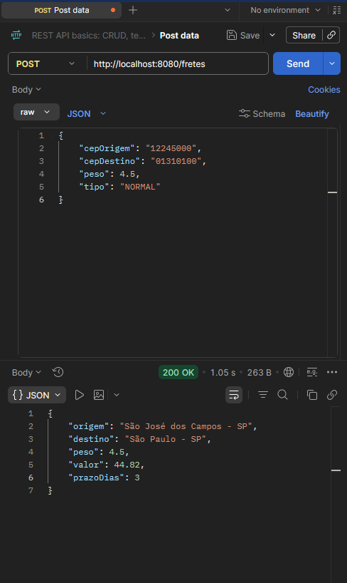
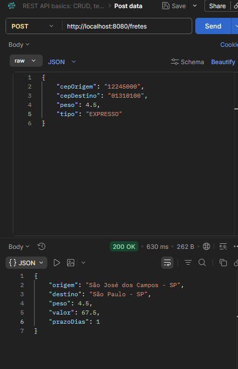
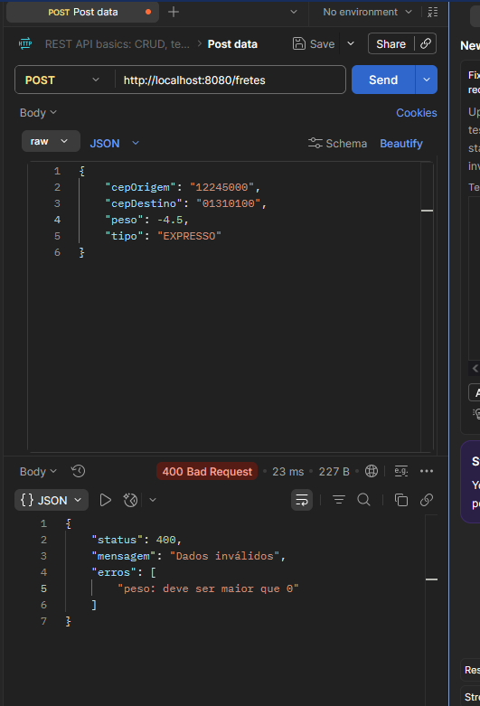

# 🚚 Frete API

API REST desenvolvida com **Java 21 e Spring Boot** para cálculo de fretes a partir de CEP, peso e tipo de envio.

O projeto foi desenvolvido com o objetivo de **aperfeiçoar conhecimentos em Java e Spring Boot**, aplicando na prática conceitos de desenvolvimento Backend, integração com APIs externas e padrões de projeto.

---

## 🛠️ Tecnologias

- Java 21
- Spring Boot
- Spring Web
- Spring Validation
- Maven
- REST
- JSON
- ViaCEP

---

## 📚 Conceitos aplicados

- Arquitetura REST
- HTTP e JSON
- Controllers
- DTOs utilizando `record`
- Injeção de dependências
- Bean Validation
- Validação customizada
- Integração com API externa
- Facade Pattern
- Strategy Pattern
- Tratamento global de exceções

---

## 🏗️ Estrutura do projeto

```text
src/main/java/com/nicollas/frete_api/

├── controller
│   └── FreteController
│
├── dto
│   ├── CepResponse
│   ├── FreteRequest
│   ├── FreteResponse
│   └── TipoFrete
│
├── facade
│   └── FreteFacade
│
├── service
│   ├── CepService
│   ├── FreteCalculadora
│   ├── FreteExpresso
│   ├── FreteNormal
│   └── FreteService
│
├── validation
│   ├── CepValidator
│   └── ValidCep
│
└── exception
    └── GlobalExceptionHandler
```

---

## 🔄 Fluxo da aplicação

O fluxo principal da aplicação segue a estrutura:

```text
Cliente
   ↓
FreteController
   ↓
FreteFacade
   ├──→ CepService → ViaCEP
   │
   └──→ FreteService
           ↓
      Strategy Pattern
       ↙           ↘
FreteNormal    FreteExpresso
```

O `FreteController` recebe a requisição e encaminha a operação para o `FreteFacade`.

O `FreteFacade` é responsável por **orquestrar o fluxo**, realizando as consultas dos CEPs e solicitando o cálculo do frete.

Já o `FreteService` utiliza o **Strategy Pattern** para selecionar a estratégia correspondente ao tipo de frete solicitado.

---

## 📌 Endpoint

### Calcular frete

```http
POST /fretes
Content-Type: application/json
```

### 📥 Request

```json
{
    "cepOrigem": "12245000",
    "cepDestino": "01310100",
    "peso": 4.5,
    "tipo": "NORMAL"
}
```

### 📤 Response

```json
{
    "origem": "São José dos Campos - SP",
    "destino": "São Paulo - SP",
    "peso": 4.5,
    "valor": 44.82,
    "prazoDias": 3
}
```

---

## 🚛 Tipos de frete

A API possui atualmente duas estratégias de cálculo.

### NORMAL

- **Valor:** peso × 9,96
- **Prazo:** 3 dias



### EXPRESSO

- **Valor:** peso × 15,00
- **Prazo:** 1 dia



---

## 🔎 Integração com ViaCEP

A aplicação utiliza a **API ViaCEP** para consultar os dados dos CEPs informados na requisição.

Os CEPs de origem e destino são consultados antes do cálculo e as informações retornadas são utilizadas para apresentar a cidade e o estado no resultado.

---

## ✅ Validações

A API utiliza **Bean Validation** para garantir a consistência dos dados recebidos.

São realizadas validações para:

- CEP obrigatório
- CEP com formato válido
- Peso maior que zero
- Tipo de frete válido

Além das validações padrão, foi criada uma **validação customizada para CEP**, utilizando `ConstraintValidator`.

---

## 📛 Tratamento de erros

A aplicação possui um tratamento global de exceções utilizando `@RestControllerAdvice`.

Os erros são retornados de forma padronizada em JSON, evitando que detalhes internos da aplicação sejam expostos ao cliente.



---

## 🎯 Objetivo do projeto

O principal objetivo deste projeto foi **aperfeiçoar meus conhecimentos em Java e Spring Boot**, aplicando na prática conceitos de desenvolvimento Backend que já conhecia.

Através de uma aplicação pequena e funcional, pude trabalhar com construção de APIs REST, validação de dados, integração com serviços externos e padrões de projeto.

O projeto também representa uma etapa da minha evolução profissional e do aprofundamento no ecossistema **Java + Spring Boot**.

---

## ▶️ Como executar

Clone o repositório:

```bash
git clone <URL_DO_REPOSITORIO>
```

Entre na pasta do projeto:

```bash
cd frete-api
```

Execute utilizando Maven:

```bash
./mvnw spring-boot:run
```

No Windows:

```bash
mvnw.cmd spring-boot:run
```

A aplicação estará disponível em:

```text
http://localhost:8080
```

---

## 👨‍💻 Autor

**Nicollas**

Projeto desenvolvido como parte da minha evolução profissional em **Desenvolvimento Backend**, com foco no ecossistema **Java + Spring Boot**.
